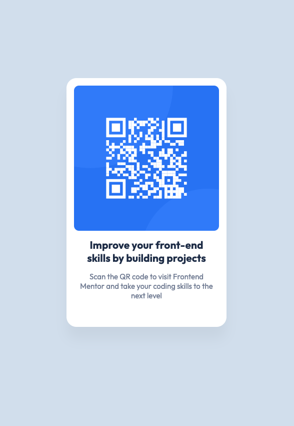

# Frontend Mentor - QR code component solution

This is a solution to the [QR code component challenge on Frontend Mentor](https://www.frontendmentor.io/challenges/qr-code-component-iux_sIO_H). Frontend Mentor challenges help you improve your coding skills by building realistic projects. 

## Table of contents

- [Overview](#overview)
  - [Screenshot](#screenshot)
  - [Links](#links)
- [My process](#my-process)
  - [Built with](#built-with)
  - [What I learned](#what-i-learned)
  - [Continued development](#continued-development)
  - [Useful resources](#useful-resources)
- [Author](#author)
- [Acknowledgments](#acknowledgments)

**Note: Delete this note and update the table of contents based on what sections you keep.**

## Overview

### Screenshot

Add a screenshot of your solution. The easiest way to do this is to use Firefox to view your project, right-click the page and select "Take a Screenshot". You can choose either a full-height screenshot or a cropped one based on how long the page is. If it's very long, it might be best to crop it.

Alternatively, you can use a tool like [FireShot](https://getfireshot.com/) to take the screenshot. FireShot has a free option, so you don't need to purchase it. 

Then crop/optimize/edit your image however you like, add it to your project, and update the file path in the image above.

### Links

- Solution URL: [Add solution URL here](https://your-solution-url.com)
- Live Site URL: [Add live site URL here](https://your-live-site-url.com)

## My process

### Built with

- Marcação de HTML semântico
- Propriedades CSS
- Flexbox
- Mobile-first

### What did I learn?

CSS é uma ciência! Incrível como há várias maneiras de chegar a um mesmo resultado. Escolhi esta forma pois é a que melhor representa meus conhecimentos sobre CSS atualmente.

#### Alguns pontos a considerar
- Com flexbox, ficou simples centralizar a imagem no meio de seu container.
- Usar as propriedades `calc` e `position:absolute` para centralizar o componente na tela foi mais fácil.
- Valores que podem ser aproveitados, são melhor gerenciados utilizando a propriedade `var`.
- `box-sizing` melhora o controle sobre `paddings` e `margins` da Box Model.
- Compreender o uso da propriedade `box-shadow`

### Continuos Development

Seguir os exemplos do site [Frontend Mentor](https://www.frontendmentor.io/) para novos desafios, incrementando o leque de recursos que essas tecnologias  oferecem.

### Useful resources

- [box-shadow](https://developer.mozilla.org/en-US/docs/Web/CSS/) - Adiciona efeitos ao redor de um elemento.

## Author

- Website - [Uélio Nobre](https://github.com/UelioNobre/portfolio-qr-code-component)
- Frontend Mentor - [@UelioNobre](https://www.frontendmentor.io/profile/UelioNobre)

## Acknowledgments

This is where you can give a hat tip to anyone who helped you out on this project. Perhaps you worked in a team or got some inspiration from someone else's solution. This is the perfect place to give them some credit.

**Note: Delete this note and edit this section's content as necessary. If you completed this challenge by yourself, feel free to delete this section entirely.**
